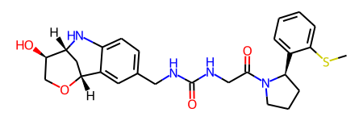
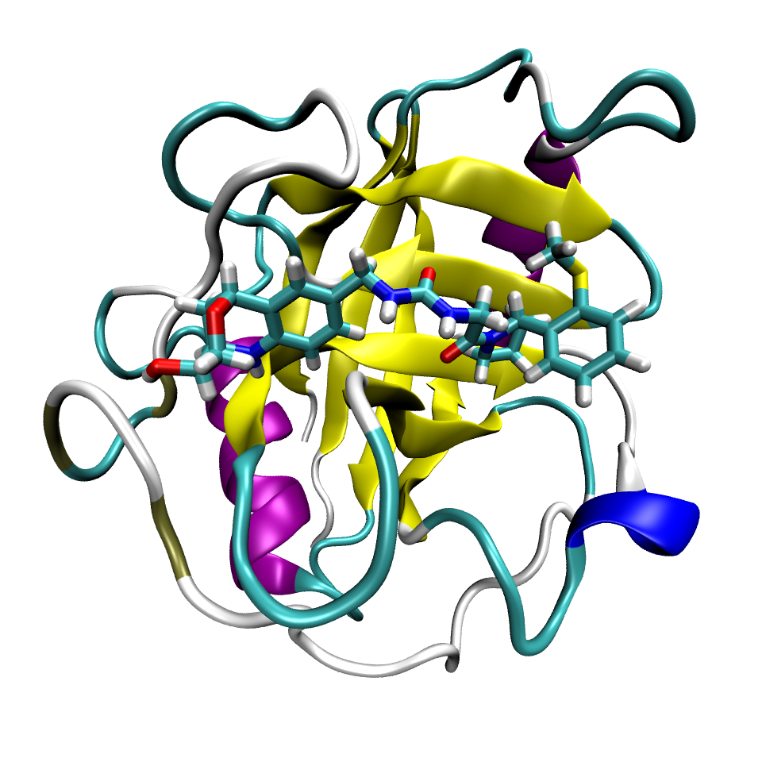

## Protein-Ligand System
For this tutorial we will look at the binding of the ligand below to the protein Cyclophilin D.



The protein-ligand system looks like this



## Prepare protein and ligand files
First, we need to prepare the ligand files. Run the following in a terminal to generate a MOL2 file with GAFF2 atom types and AM1BCC charges
```bash
antechamber -fi pdb -fo mol2 -i ligand.pdb -o ligand.am1bcc.gaff2.mol2 -at gaff2 -c bcc -rn LIG -pf y 
```
Next, we generate a `frcmod` file to add any missing bonded parameters.
```bash
parmchk2 -f mol2 -i ligand.am1bcc.gaff2.mol2 -s gaff2 -o ligand.frcmod
```
For the protein, we will need to remove any hydrogen atoms otherwise `tleap` will complain about atom names not recognized in AMBER.
```bash
pdb4amber --nohyd protein.pdb > protein.noH.pdb
```

Now that we have a prepared protein and ligand PDB files, we can combine these two with OpenMM modules to get a single PDB file (run `python 02-combine_protein-ligand.py` on the terminal).
```python
from openmm.app import PDBFile, Modeller

protein = PDBFile("protein.noH.pdb")
ligand = PDBFile("ligand.pdb")

protein_ligand = Modeller(protein.topology, protein.positions)
protein_ligand.add(ligand.topology, ligand.positions)

with open("protein_ligand.pdb", "w") as f:
    PDBFile.writeFile(
        protein_ligand.topology,
        protein_ligand.positions,
        f,
    )
```

## Build AMBER Topologies
Next, we will use the `TLeap` API from pAPRika to build the AMBER files. We will build AMBER files for the ligand and protein-ligand system with the `mbondi2` radii (used in OBC2 implicit solvent model). For the protein we will use the `ff19SB` force field model. The python code below creates the AMBER files (run `python 03-create_system.py` on the terminal).
```python
from paprika.build.system import TLeap

# Build AMBER Topologies for Ligand
system = TLeap()
system.output_prefix = "ligand-ff19SB"
system.neutralize = False
system.pbc_type = None
system.template_lines = [
    "set default PBRadii mbondi2",
    "source leaprc.gaff2",
    "loadamberparams ligand.frcmod",
    "LIG = loadmol2 ligand.am1bcc.gaff2.mol2",
    "model = loadpdb ligand.pdb",
]
system.build(clean_files=False)
# Do HMR so we can increase integration time step
system.repartition_hydrogen_mass()

# Build AMBER Topologies for Protein-Ligand system
system = TLeap()
system.output_prefix = "protein-ligand-ff19SB"
system.neutralize = False
system.pbc_type = None
system.template_lines = [
    "set default PBRadii mbondi2",
    "source leaprc.protein.ff19SB",
    "source leaprc.water.opc",
    "source leaprc.gaff2",
    "loadamberparams ligand.frcmod",
    "LIG = loadmol2 ligand.am1bcc.gaff2.mol2",
    "model = loadpdb protein_ligand.pdb",
]
system.build(clean_files=False)
# Do HMR so we can increase integration time step
system.repartition_hydrogen_mass()
```
